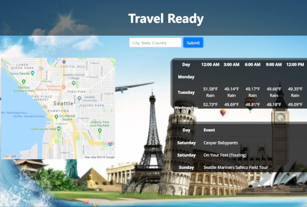

# Project-1
# Travel Ready

### Inputs: 
* city 
* state 
* country

### Results: 
* Gathers all of your travel information in one place: 
    * Weather
    * Map
    * Events

* Uses **Google Place Autocomplete library** to Autocomplete the location input. 
* Uses **AJAX** and **JSON**.
* Uses **Modals** for incomplete input, incorrect input, and errors.
* Uses **Google Maps API** to return a map of the location input.
* Uses **Open Weather Map API** to create a 5 day weather forecast table with a temperature and weather description every 3 hours for the location input.  
* Uses **Ticketmaster API** to create a table of the top 5 current events happening at the location input.  
* The weather table and the events table use **Moment.js** to convert a date to a day of the week.  
* Uses **Bootstrap** and **Google Fonts** styling.
* Mobile responsive.
* Coded using **HTML**, **CSS**, **Javascript**, and **JQuery**.